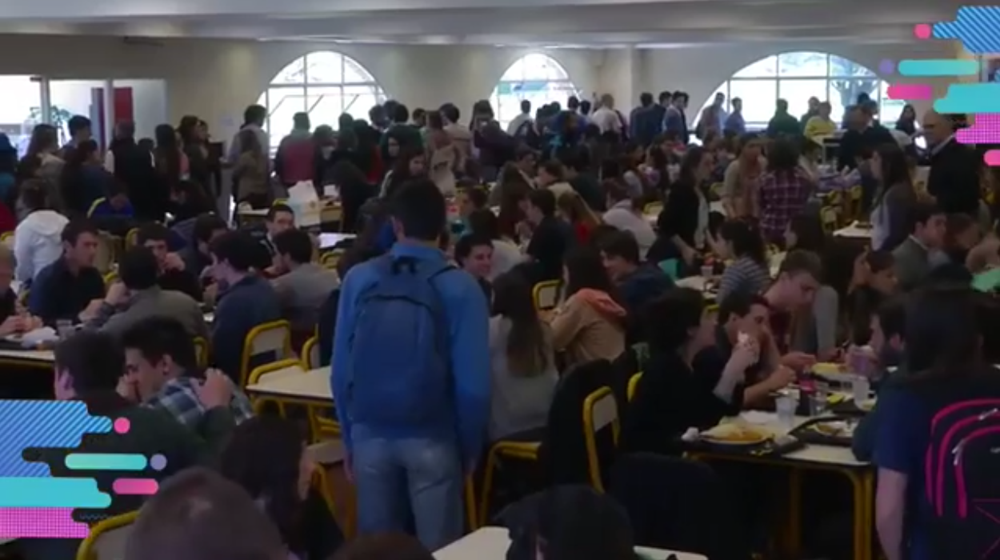

A lo largo de los años se ha observado que en el comedor de la universidad en Tandil los tiempos de espera para la compra de menús han ido aumentando, llegando a casos donde un alumno puede estar esperando durante *mas de una hora* para poder almorzar. A su vez, la gran congestión de gente genera una presión adicional sobre el personal encargado de producir y distribuir los menús, provocando muchas veces resultados no tan favorables. Mediante el siguiente trabajo se desea encontrar alguna solución para **optimizar estos tiempos de espera**. Se tuvo en cuenta que esta situacion no es constante a lo largo del año: se estudiaron las variaciones que existen en los distintos cuatrimestres, meses y días de la semana para poder lograr una solución mas acertada.

Regularmente el comedor cuenta con dos cajas que poseen una cola compartida donde los alumnos pueden realizar sus pedidos y una caja automatica con tarjeta que tiene una cola aparte. Luego de pagar en cualquiera de las cajas, se suman a una seguna cola donde esperan la entrega de los menus. Ambas colas cuentan con un alto tiempo de espera, y la mayor concentración de clientes se da en la segunda cola. El comedor cuenta con espacio para 400 personas sentadas, lo cual, en días muy concurridos, genera paralelamente una tercera posible cola de alumnos que esperan un lugar donde sentarse desde el momento en que ingresan al comedor.  

A pesar de contar con la base de datos del comedor y obteniendo asi los detalles de las ventas realizadas, **no se cuenta con un sistema que guarde los tiempos de llegada y de espera**, por lo que se decidió realizar una simulación para poder reconocer posibles soluciones.

